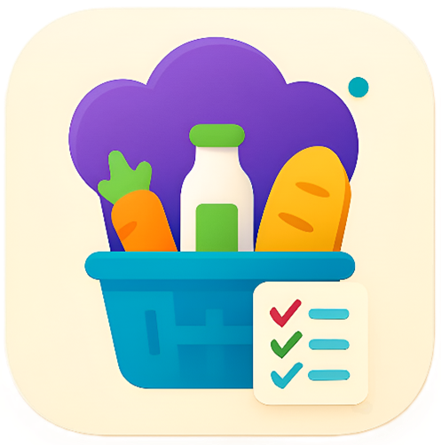
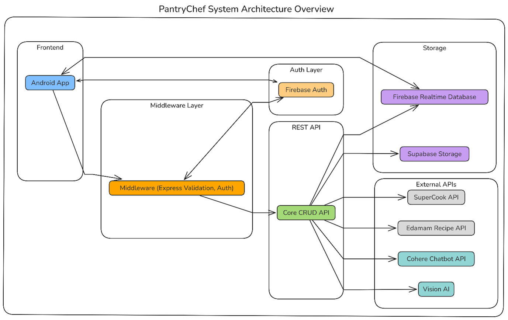
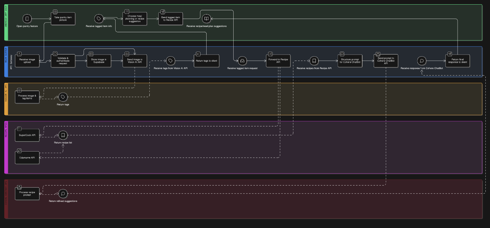

PantryChef 🍳
=============

PantryChef is a zero-waste cooking companion designed to simplify meal preparation, reduce food waste, and inspire creativity in the kitchen. By blending intelligent recommendations with a user-first design, PantryChef transforms everyday ingredients into exciting meals, empowering users to rediscover the joy of cooking.

* * * * *

### Table of Contents

-   [About The Project](#about-the-project)

-   [Design Considerations](#design-considerations)

-   [Key Features](#key-features)

-   [Technology Stack & Architecture](#technology-stack--architecture)

-   [Navigation Flow](#navigation-flow)

-   [Development Workflow](#development-workflow)

-   [Getting Started (For Developers)](#getting-started-for-developers)

-   [Installation (For Users)](#installation-for-users)

-   [Project Team](#project-team)

* * * * *

About The Project
-----------------

PantryChef is a complete kitchen partner designed to simplify meal preparation and inspire confidence in the kitchen. By combining AI-driven intelligence with a user-friendly design, the app transforms pantry management into a proactive and enjoyable experience. The goal is to provide a complete kitchen partner that not only helps users discover creative recipes but also automates planning, shopping, and organisation.

* * * * *

Design Considerations
---------------------

The design of PantryChef is firmly grounded in research and a commitment to a scalable, user-centric architecture.

-   **Research-Driven Approach:** The project began by analysing competing apps like AnyList, Paprika, and SuperCook to identify well-received features and areas for improvement. Insights from this research directly informed PantryChef's design; for example, SuperCook validated our ingredient-first recipe concept, while Paprika highlighted the need for robust offline capabilities.

-   **User-Centric UI/UX:** The user experience is designed to be seamless, from a multi-step onboarding process that personalises the app from the start, to an integrated profile and settings hub for easy management. The navigation is handled by a single `Activity` managing multiple `Fragment`'s, ensuring a fast and fluid interface without the jarring transitions of traditional multi-activity apps.

-   **Scalable Architecture:** The system employs a modern three-tier architecture to separate concerns between the frontend, backend, and data storage layers. The Node.js middleware serves as a central orchestrator, allowing the Android client to remain lightweight while enabling complex business logic and integration with multiple external APIs.

* * * * *

Key Features
------------

PantryChef is packed with features designed to create a seamless cooking journey, from pantry to plate.

#### Core Features

-   **Single Sign-On (SSO) & Biometric Authentication:** Securely log in via Google Sign-In, email/password, or biometrics for quick access.

-   **User Settings Management:** A dedicated profile section to manage account details, update dietary preferences, customise notifications, and switch themes.

-   **Offline Mode:** View and edit your pantry, recipes, and shopping lists without an internet connection. Changes are cached locally and synced automatically when connectivity is restored.

-   **Real-Time Push Notifications:** Receive timely expiry alerts and personalised recipe suggestions via Firebase Cloud Messaging.

-   **Multi-Language Support:** Full support for English, Afrikaans, and isiZulu.

#### Innovative Features

-   🧠 **AI-Powered Recipe Discovery:** Generate personalised recipes by analysing your pantry's contents using the SuperCook and Edamam APIs.

-   🥫 **Intelligent Pantry Management:** Add items by scanning with your camera (Vision AI), using voice input, or manual entry.

-   🛒 **Smart Shopping List Generator:** Automatically create shopping lists from recipes, intelligently subtracting items you already own.

-   🧑‍🍳 **Interactive Recipe Assistant:** An integrated Cohere-powered chatbot provides real-time cooking help, offering ingredient substitutions and technique explanations.

* * * * *

Technology Stack & Architecture
-------------------------------

PantryChef is built on a modern, three-tier architecture designed for scalability and maintainability.

-   **Frontend:**

    -   **Platform:** Native Android

    -   **Language:** Kotlin

    -   **Key Libraries:** Android Views, Navigation Component, ViewModel, LiveData, Retrofit, Glide, Coroutines.

-   **Backend (Middleware):**

    -   **Framework:** Node.js with Express.js

    -   **Hosting:** Render

-   **Authentication:**

    -   **Provider:** Firebase Authentication (Email/Password, Google SSO)

-   **Storage:**

    -   **Database:**  **Cloud Firestore** (Note: Real-time sync features are planned for Part 3)

    -   **Image Storage:** Supabase Storage

-   **External APIs:**

    -   **Recipe Search:** SuperCook API, Edamam API

    -   **AI Chatbot:** Cohere API

    -   **Image Recognition:** Vision AI (.NET Service)



* * * * *

Navigation Flow
---------------

The app's navigation is structured around a central `BottomNavigationView` with five main destinations. The entire profile section is managed within its own nested navigation graph to keep the architecture modular and easy to manage.



* * * * *

Development Workflow
--------------------

This project utilises Git for version control and is hosted on GitHub to facilitate collaboration.

-   **Branching Strategy:** We follow the popular GitFlow model:

    -   `main`: Contains production-ready, stable code.

    -   `develop`: The primary branch for ongoing development. All feature branches are merged into `develop`.

    -   `feature/<feature-name>`: Individual branches for new features or bug fixes (e.g., `feature/profile-settings`).

-   **GitHub Actions for CI/CD:** Continuous Integration is set up using GitHub Actions. A workflow is configured to automatically trigger on every push to the `develop` branch. This workflow:

    1.  Sets up a Java and Android environment.

    2.  Builds the debug version of the application (`./gradlew assembleDebug`).

    3.  Runs any available unit tests (`./gradlew test`).

    This ensures that code merged into the `develop` branch is always in a buildable and tested state, improving code quality and stability.

* * * * *

Getting Started (For Developers)
--------------------------------

To get a local copy up and running, follow these simple steps.

#### Prerequisites

-   Android Studio (latest stable version recommended)

-   Git

#### Setup Instructions

1.  **Clone the repository:**

    Bash

    ```
    git clone https://github.com/PROG7314-POE-SSB/PROG7314-POE-Part-2-Android-App.git

    ```

2.  **Open in Android Studio:** Open the cloned folder as a new project.

3.  **Firebase Configuration (CRITICAL):**

    -   Go to the [Firebase Console](https://console.firebase.google.com/) and create a new project.

    -   Add an Android app to your project with the package name `com.ssba.pantrychef`.

    -   In your project, enable **Authentication** (Email/Password, Google) and **Cloud Firestore**.

    -   Download the `google-services.json` file from your Firebase project settings and place it in the `app/` directory.

4.  **Supabase & Google SSO Configuration:**

    -   In `app/src/main/res/values/`, create a new file named `secrets.xml`.

    -   Add your keys to this file (this file is in `.gitignore` and will not be committed).

        ``` XML
        <?xml version="1.0" encoding="utf-8"?>
        <resources>
            <string name="supabase_url">YOUR_SUPABASE_URL</string>
            <string name="supabase_api_key">YOUR_SUPABASE_ANON_KEY</string>

            <string name="default_web_client_id">YOUR_GOOGLE_WEB_CLIENT_ID</string>
        </resources>

        ```

    -   To enable Google Sign-In, add your computer's **SHA-1 fingerprint** to your Firebase project settings.

5.  **Build and Run:** Sync the project with Gradle files and run the application.

* * * * *

Installation (For Users)
------------------------

If you just want to try the app, you can download the latest pre-built APK file.

1.  Go to the **[Releases](https://github.com/PROG7314-POE-SSB/PROG7314-POE-Part-2-Android-App/releases)** tab of this GitHub repository.

2.  Under the latest release, find the `app-debug.apk` file in the "Assets" section.

3.  Download and install the file on your Android device.

* * * * *

Project Team
------------

This application was designed and developed by **SSB Digital (Group 2)**:

-   Sashveer Lakhan Ramjathan (ST10361554)

-   Shravan Ramjathan (ST10247982)

-   Blaise Mikka de Gier (ST10249838)

------------
